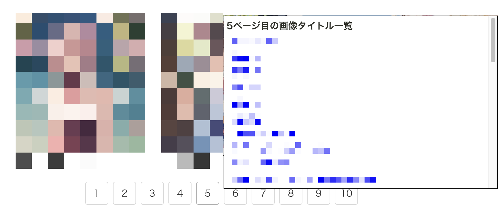

# chichi-pui pager

AIイラスト・AIフォト・AIグラビア専用の投稿サイトである[『chichi-pui（ちちぷい）』](https://www.chichi-pui.com/)内のページャーから各ページに移動しやすくするために独自に改良したページャーChrome拡張機能です。

[こちらからChrome拡張機能はインストールできます。](https://chromewebstore.google.com/detail/chichi-pui-pager-unoffici/ladjbhiiabeliofigcndnijpjampbhoe)

## Usage
Chrome拡張機能を有効にした状態でちちぷい内の対象のページに移動した際に、画面下部のページャーがChrome拡張機能独自のものに置き換えられて表示されます。

### ポップアップのオプション
バージョン `0.0.2` よりポップアップのオプションを追加しています。  
こちらを利用することにより、ページリンク先で表示されている画像タイトルの一覧を、ページに遷移せずとも確認できるようになります。

こちらを有効化するには、Chrome拡張機能の詳細ページを開き、 `拡張機能のオプション` という項目をクリックしてください。

そして、`ポップアップ表示を有効にする` というチェックボックスにチェックを付けてください

こちらの設定を有効化してからページをリロードすることで、ページ遷移先の画像タイトル一覧がポップアップで表示されるようになります。

バージョン `0.0.3` より各タイトルをクリックすることで対象の画像ページを開けるようになりました。

## License

MIT